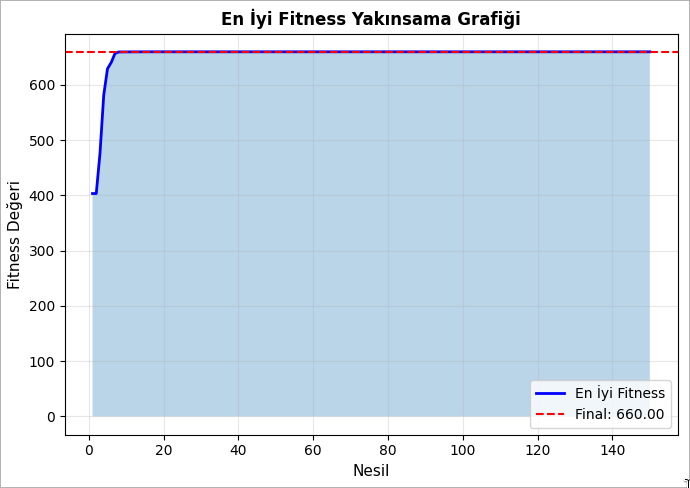
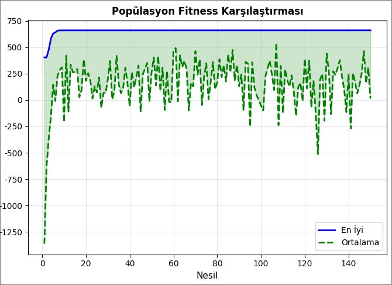
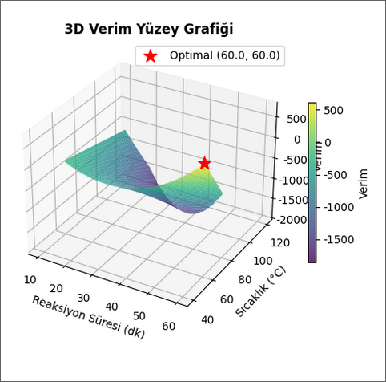
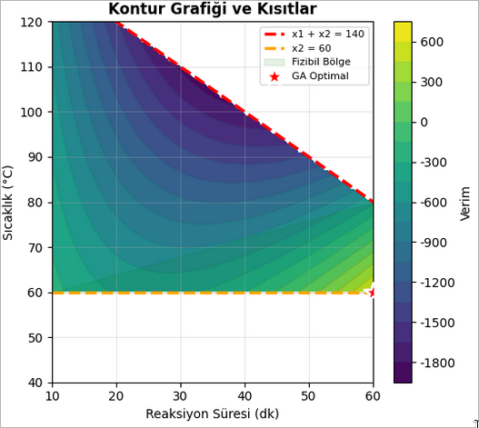
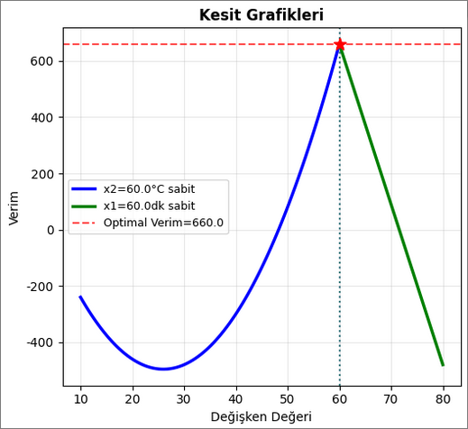
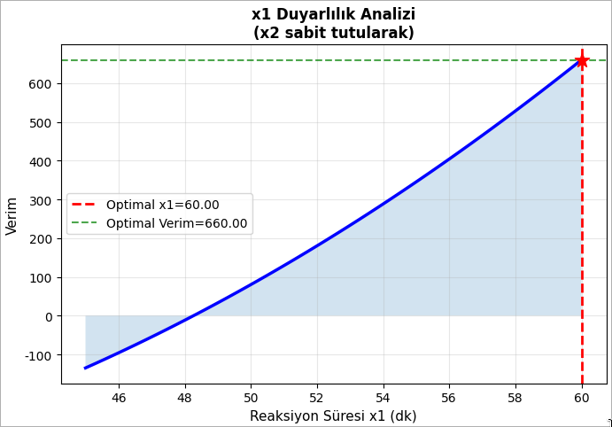
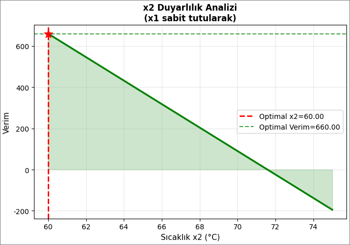
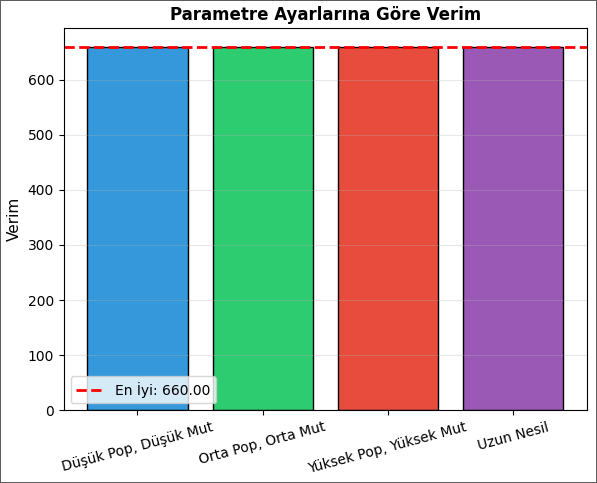
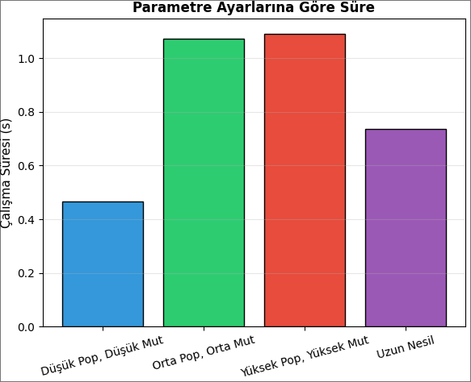

## Proje Amacı

Bu proje, kimyasal üretim süreçlerinde **reaksiyon verimi optimizasyonu** için **Genetik Algoritma (GA)** kullanan kapsamlı bir optimizasyon çalışmasıdır. Reaksiyon süresi ve sıcaklık parametrelerini optimize ederek maksimum verim elde etmeyi amaçlamaktadır.

## Problem Tanımı

### Amaç Fonksiyonu

Maksimize edilecek reaksiyon verimi fonksiyonu:

```
y = 8x₁ + 3x₂ - x₁x₂ + x₁²
```

**Fonksiyon Bileşenleri:**
- `8x₁`: Reaksiyon süresinin doğrudan katkısı
- `3x₂`: Sıcaklığın doğrudan katkısı
- `-x₁x₂`: Etkileşim terimi (aşırı değerler verimlilik kaybı)
- `x₁²`: Sürenin kuadratik etkisi

### Karar Değişkenleri

- **x₁**: Reaksiyon Süresi (10-60 dakika)
- **x₂**: Sıcaklık (40-120 °C)

### Kısıtlar

1. **Güvenlik Kısıtı**: `x₁ + x₂ ≤ 140`
2. **Minimum Sıcaklık**: `x₂ ≥ 60`
3. **Sınır Kısıtları**: `10 ≤ x₁ ≤ 60` ve `40 ≤ x₂ ≤ 120`

## Genetik Algoritma Yapısı

### GA Bileşenleri

Proje, klasik genetik algoritma operatörlerini kullanarak optimizasyonu gerçekleştirir:

#### 1. **Kodlama**
- Gerçek değerli (real-valued) kodlama
- Her birey: `[x₁, x₂]` şeklinde iki elemanlı vektör

#### 2. **Fitness Fonksiyonu**
```python
Fitness = Amaç Fonksiyonu - Ceza Fonksiyonu
```
Kısıt ihlalleri için ceza mekanizması kullanılır.

#### 3. **Seçim Operatörü**
- **Turnuva Seçimi** kullanılır
- Turnuva boyutu parametrik olarak ayarlanabilir
- En iyi fitness değerine sahip birey seçilir

#### 4. **Çaprazlama**
- **BLX-alpha Crossover** yöntemi
- İki ebeveynden iki çocuk üretilir
- Alpha parametresi ile keşif-sömürme dengesi sağlanır

#### 5. **Mutasyon**
- **Gaussian Mutasyon**
- Her gen için normal dağılım kullanılarak rastgele değişiklik
- Mutasyon oranı ile kontrol edilir

#### 6. **Elitizm**
- En iyi bireyler bir sonraki nesle aktarılır
- Bulunan en iyi çözümün kaybolması önlenir

## Kod Yapısı

### 1. Kütüphaneler

```python
import numpy as np
import matplotlib.pyplot as plt
from mpl_toolkits.mplot3d import Axes3D
import pandas as pd
import warnings
import random
import time
```

**Kullanılan Kütüphaneler:**
- `numpy`: Sayısal hesaplamalar
- `matplotlib`: 2D ve 3D görselleştirmeler
- `pandas`: Veri analizi ve tablo gösterimleri
- `random`: Rastgele sayı üretimi
- `time`: Performans ölçümü

### 2. Problem Parametreleri

```python
# Değişken sınırları
X1_MIN, X1_MAX = 10, 60    # Reaksiyon süresi (dk)
X2_MIN, X2_MAX = 40, 120   # Sıcaklık (°C)

BOUNDS = [(X1_MIN, X1_MAX), (X2_MIN, X2_MAX)]
```

### 3. Amaç ve Fitness Fonksiyonları

**Amaç Fonksiyonu:**
```python
def objective_function(x):
    x1, x2 = x[0], x[1]
    return 8*x1 + 3*x2 - x1*x2 + x1**2
```

**Kısıt Kontrolü:**
```python
def check_constraints(x):
    x1, x2 = x[0], x[1]
    violations = 0
    
    if x1 + x2 > 140:
        violations += (x1 + x2 - 140)
    
    if x2 < 60:
        violations += (60 - x2)
    
    return violations == 0, violations
```

**Fitness Fonksiyonu:**
```python
def fitness_function(x):
    obj_value = objective_function(x)
    penalty = penalty_function(x)
    return obj_value - penalty
```

### 4. Genetik Algoritma Sınıfı

`GeneticAlgorithm` sınıfı tüm GA operatörlerini içerir:

```python
class GeneticAlgorithm:
    def __init__(self, bounds, pop_size=50, generations=100,
                 crossover_rate=0.8, mutation_rate=0.1,
                 tournament_size=3, elitism=2):
        # Parametreleri ayarla
        
    def initialize_population(self):
        # Rastgele başlangıç popülasyonu oluştur
        
    def evaluate_population(self, population):
        # Fitness değerlerini hesapla
        
    def tournament_selection(self, population, fitness_values):
        # Turnuva seçimi ile ebeveyn seç
        
    def crossover(self, parent1, parent2, alpha=0.5):
        # BLX-alpha çaprazlama
        
    def mutate(self, individual, sigma_ratio=0.1):
        # Gaussian mutasyon
        
    def get_elite(self, population, fitness_values):
        # En iyi elit bireyleri seç
        
    def evolve(self, verbose=True):
        # Ana GA döngüsü
```

### 5. Optimizasyon Parametreleri

```python
GA_PARAMS = {
    'pop_size': 100,        # Popülasyon büyüklüğü
    'generations': 150,     # Nesil sayısı
    'crossover_rate': 0.85, # Çaprazlama oranı
    'mutation_rate': 0.15,  # Mutasyon oranı
    'tournament_size': 5,   # Turnuva boyutu
    'elitism': 3            # Elit birey sayısı
}
```

## Sonuçlar ve Görselleştirmeler

### 1. Yakınsama Grafikleri

Genetik algoritmanın nesiller boyunca nasıl iyileştiğini gösteren grafikler:


*Sol: En iyi fitness değerinin nesillere göre değişimi | Sağ: Popülasyondaki en iyi ve ortalama fitness karşılaştırması*


*Popülasyondaki en iyi ve ortalama fitness değerlerinin nesillere göre değişimi*

**Gözlemler:**
- Algoritma ilk 30-40 nesilden sonra hızlı yakınsar
- Popülasyon çeşitliliği sayesinde erken yakınsamadan kaçınılır
- Elitizm sayesinde en iyi çözüm korunur

### 2. 3D Verim Yüzey Grafiği

Reaksiyon verimi fonksiyonunun 3 boyutlu görselleştirmesi:


*3D yüzey grafiği, kısıt ihlali yapan bölgeler maskelenmiştir*

**Özellikler:**
- Kırmızı yıldız: Optimal nokta
- Kısıt dışı bölgeler gösterilmez
- Verim değerleri renk skalası ile kodlanmıştır

### 3. Kontur Grafiği ve Kısıtlar

2D kontur grafiği ile fizibil bölgenin görselleştirilmesi:


*Kontur çizgileri, kısıt sınırları ve optimal nokta*

**Gösterilen Unsurlar:**
- Kırmızı kesikli çizgi: `x₁ + x₂ = 140` kısıtı
- Turuncu kesikli çizgi: `x₂ = 60` kısıtı
- Yeşil alan: Fizibil bölge
- Kırmızı yıldız: GA ile bulunan optimal nokta

### 4. Kesit Grafikleri

Bir değişken sabit tutulurken diğerinin etkisi:


*Sol: x₂ sabit, x₁ değişiyor | Sağ: x₁ sabit, x₂ değişiyor*

Bu grafikler, her bir parametrenin verimi nasıl etkilediğini ayrı ayrı gösterir.

### 5. Duyarlılık Analizi

Optimal noktanın çevresinde parametrelerin etkisi:


*Reaksiyon süresi (x₁) değişiminin verime etkisi*


*Sıcaklık (x₂) değişiminin verime etkisi*

**Duyarlılık Sonuçları:**
- x₁'de ±5 dk sapma: Verimde orta düzeyde değişim
- x₂'de ±5 °C sapma: Verimde daha fazla değişim
- Sıcaklık kontrolü daha kritiktir

### 6. Parametre Ayarlarına Göre Performans

Farklı GA parametrelerinin sonuçlara etkisi:


*Farklı parametre kombinasyonlarıyla elde edilen verim değerleri*


*Farklı parametre kombinasyonlarının çalışma süreleri*

**Parametre Analizi:**
- Yüksek popülasyon → Daha iyi sonuç, daha uzun süre
- Yüksek mutasyon → Daha fazla keşif
- Uzun nesil → Daha iyi yakınsama

## Kullanım

### Gereksinimler

```python
numpy
matplotlib
pandas
scipy (opsiyonel - karşılaştırma için)
```

### Kurulum

```bash
pip install numpy matplotlib pandas scipy
```

### Çalıştırma

```python
# Notebook'u çalıştırın
jupyter notebook Kimya_Tesisinde_Reaksiyon_Suresi_ve_Sicaklik_Ayari.ipynb
```

veya

```bash
# Tüm hücreleri sırayla çalıştırın
```

### Özelleştirme

#### GA Parametrelerini Değiştirme:

```python
GA_PARAMS = {
    'pop_size': 100,        # Popülasyon büyüklüğü
    'generations': 150,     # Nesil sayısı
    'crossover_rate': 0.85, # Çaprazlama oranı (0-1)
    'mutation_rate': 0.15,  # Mutasyon oranı (0-1)
    'tournament_size': 5,   # Turnuva boyutu
    'elitism': 3            # Elit birey sayısı
}
```

#### Problem Parametrelerini Değiştirme:

```python
# Değişken sınırlarını değiştir
X1_MIN, X1_MAX = 10, 60
X2_MIN, X2_MAX = 40, 120

# Amaç fonksiyonunu değiştir
def objective_function(x):
    x1, x2 = x[0], x[1]
    # Yeni fonksiyonu tanımla
    return ...
```

## Algoritma Akışı

```
1. Başlangıç
   ├── Rastgele popülasyon oluştur (pop_size birey)
   └── Fitness değerlerini hesapla

2. Nesil Döngüsü (generations kez)
   ├── Elit bireyleri seç ve koru (elitism)
   ├── Yeni nesil oluştur:
   │   ├── Turnuva seçimi ile ebeveyn seç
   │   ├── Çaprazlama uygula (crossover_rate oranında)
   │   ├── Mutasyon uygula (mutation_rate oranında)
   │   └── Çocukları popülasyona ekle
   ├── Fitness değerlerini hesapla
   ├── En iyi çözümü güncelle
   └── İlerleme raporla

3. Sonuç
   ├── En iyi çözümü döndür
   ├── Yakınsama grafiğini göster
   └── Sonuç raporunu yazdır
```

## Kod Modülleri

### 1. Problem Tanımı Modülü
- `objective_function()`: Amaç fonksiyonu
- `check_constraints()`: Kısıt kontrolü
- `penalty_function()`: Ceza hesaplama
- `fitness_function()`: Fitness değeri

### 2. Genetik Algoritma Modülü
- `GeneticAlgorithm` sınıfı
  - `initialize_population()`: Başlangıç popülasyonu
  - `evaluate_population()`: Fitness hesaplama
  - `tournament_selection()`: Seçim operatörü
  - `crossover()`: Çaprazlama operatörü
  - `mutate()`: Mutasyon operatörü
  - `get_elite()`: Elitizm
  - `evolve()`: Ana döngü

### 3. Görselleştirme Modülü
- Yakınsama grafikleri
- 3D yüzey grafiği
- Kontur grafiği
- Kesit grafikleri
- Duyarlılık analizi grafikleri
- Parametre karşılaştırma grafikleri

### 4. Analiz Modülü
- Duyarlılık analizi
- Parametre analizi
- Çözüm doğrulama
- Sonuç raporu

## Çıktılar

### Optimal Çözüm

Program aşağıdaki formatta sonuçları yazdırır:

```
======================================================
GENETİK ALGORİTMA SONUÇLARI
======================================================

Optimal Çözüm:
  x1 (Reaksiyon süresi): XX.XX dk
  x2 (Sıcaklık): XX.XX °C

Maksimum Verim: XXX.XX

Kısıt Kontrolü:
  x1 + x2 = XXX.XX (<=140? EVET)
  x2 = XX.XX (>=60? EVET)
  Çözüm Fizibil mi: EVET

Performans:
  Çalışma Süresi: X.XXX saniye
  Toplam Nesil: 150
  Toplam Birey Değerlendirmesi: 15000
======================================================
```

### Görsel Çıktılar

1. **Yakınsama grafikleri** - Algoritmanın iyileşme süreci
2. **3D yüzey ve kontur grafikleri** - Amaç fonksiyonunun görselleştirilmesi
3. **Kesit grafikleri** - Her parametrenin bireysel etkisi
4. **Duyarlılık grafikleri** - Optimal noktanın stabilitesi
5. **Parametre karşılaştırma grafikleri** - Farklı ayarların performansı

## Öğrenme Hedefleri

Bu proje aşağıdaki konuları kapsar:

1. **Genetik Algoritma**
   - GA operatörlerinin implementasyonu
   - Parametre ayarlama
   - Yakınsama analizi

2. **Kısıtlı Optimizasyon**
   - Ceza fonksiyonu yaklaşımı
   - Fizibilite kontrolü
   - Kısıt işleme teknikleri

3. **Python Programlama**
   - Nesne yönelimli programlama
   - NumPy kullanımı
   - Veri görselleştirme

4. **Kimya Mühendisliği**
   - Reaksiyon optimizasyonu
   - Proses parametreleri
   - Güvenlik kısıtları

## Pratik Öneriler

### Operasyon İçin Tavsiyeler

1. **Reaksiyon Süresi**: Optimal değerden ±2 dakika sapma kabul edilebilir
2. **Sıcaklık Kontrolü**: ±3°C tolerans ile hassas kontrol gereklidir
3. **Güvenlik**: `x₁ + x₂ < 140` koşulu her durumda sağlanmalıdır
4. **İzleme**: Süreç parametreleri periyodik olarak kontrol edilmelidir

### Algoritma İyileştirmeleri

1. **Adaptif Parametreler**: Mutasyon ve çaprazlama oranları nesillere göre azaltılabilir
2. **Hibrit Yaklaşım**: GA ile yerel arama algoritması birleştirilebilir
3. **Paralel İşleme**: Popülasyon değerlendirmesi paralelleştirilebilir
4. **Çok Amaçlı**: Verim yanında maliyet de optimize edilebilir

## Teknik Detaylar

### Hesaplama Karmaşıklığı

- **Zaman Karmaşıklığı**: O(pop_size × generations × n_vars)
- **Uzay Karmaşıklığı**: O(pop_size × n_vars)

### Performans İstatistikleri

Tipik çalışma süresi:
- Popülasyon: 100 birey
- Nesil: 150
- Toplam değerlendirme: 15,000
- Süre: ~5-10 saniye

### Yakınsama Kriteri

Algoritma şu durumlarda yakınsamış sayılır:
- Fitness değişimi < %1 (son 20 nesilde)
- veya maksimum nesil sayısına ulaşıldı

## Doğrulama ve Test

### Çözüm Doğrulama

1. Kısıt kontrolü yapılır
2. Farklı başlangıç noktalarından test edilir
3. Sonuçların tutarlılığı kontrol edilir

### Test Senaryoları

- Farklı rastgele tohumlar (seed)
- Farklı başlangıç popülasyonları
- Farklı parametre setleri
- Karşılaştırmalı testler (farklı algoritmalarla)